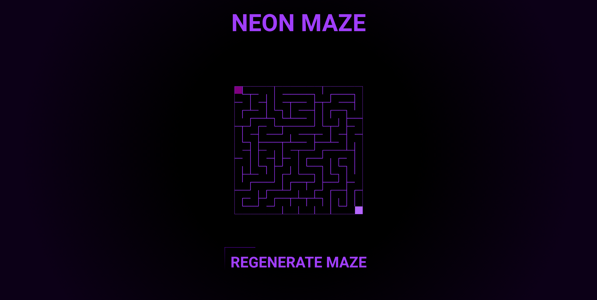
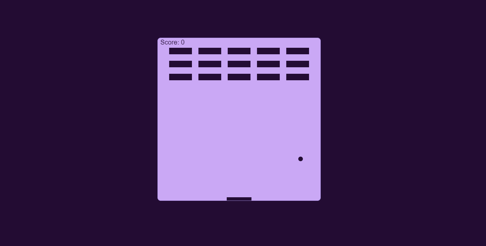

<!DOCTYPE html>
<html class="no-js" lang="en">
<head>

    <!--- basic page needs
    ================================================== -->
    <meta charset="utf-8">
    <title>NIK BAZATO</title>
    <meta name="description" content="">
    <meta name="author" content="">

    <!-- mobile specific metas
    ================================================== -->
    <meta name="viewport" content="width=device-width, initial-scale=1">

    <!-- CSS
    ================================================== -->
    <link rel="stylesheet" href="css/styles.css">
    <link rel="stylesheet" href="css/vendor.css">

    <!-- script
    ================================================== -->
    
    

    <!-- favicons
    ================================================== -->
    <link rel="apple-touch-icon" sizes="180x180" href="apple-touch-icon.png">
    <link rel="icon" type="image/png" sizes="32x32" href="favicon-32x32.png">
    <link rel="icon" type="image/png" sizes="16x16" href="favicon-16x16.png">
    <link rel="manifest" href="site.webmanifest">

</head>

<body id="top">

    <!-- preloader
    ================================================== -->
    

        

            

            

            

        

    

    <!-- header
    ================================================== -->
    <header class="s-header">

        

            
        

        

    
            <nav class="s-header__nav-wrap">
                <ul class="s-header__nav">
                    <li><a class="smoothscroll" href="#hero" title="Intro">Home</a></li>
                    <li><a class="smoothscroll" href="#about" title="About">About</a></li>
                    <li><a class="smoothscroll" href="#services" title="Services">Skils</a></li>
                    <li><a class="smoothscroll" href="#portfolio" title="Works">Works</a></li>
                </ul>
            </nav> <!-- end s-header__nav-wrap -->

            <a href="mailto:nik.bazato@gmail.com" class="btn btn--primary btn--small">
                <svg xmlns="http://www.w3.org/2000/svg" width="24" height="24" viewBox="0 0 24 24"><path d="M24 0l-6 22-8.129-7.239 7.802-8.234-10.458 7.227-7.215-1.754 24-12zm-15 16.668v7.332l3.258-4.431-3.258-2.901z"/></svg>
                Contact me 
            </a>

        
 <!-- end header-content -->

        <a class="s-header__menu-toggle" href="#0">Menu</a>

    </header> <!-- end s-header -->

    <!-- hero
    ================================================== -->
    <section id="hero" class="s-hero target-section">

        

            

        

        

            

                <h1>Hello.</h1>
                

                    

                        My name is Nik Bazato.  
                        I am a student, studying computer science at the 
                        Electrotechnical and Computer School in Nova Gorica.
                    

    
                    <footer>
                        

                            <a href="#0"><i class="fab fa-facebook-f" aria-hidden="true"></i></a>
                            <a href="#0"><i class="fab fa-twitter" aria-hidden="true"></i></a>
                            <a href="#0"><i class="fab fa-instagram" aria-hidden="true"></i></a>
                        

                    </footer>
                

            

        

        

            <a href="#about" class="s-hero__scroll-link smoothscroll">
                Scroll Down
            </a>
        

    </section> <!-- end s-hero -->

    <!-- about
    ================================================== -->
    <section id="about" class="s-about">

        

        

            

                

                    <h3 class="h6">ABOUT ME</h3>
                

            

            

                <h1 class="display-1" data-aos="fade-up">
                    I stride towards a goal of mine, that goal is to obtain as much knowladge as I can and hopefully use it someday.
                </h1>

                

                    Knowledge and skills are very important, and so I want to learn and obtain them. The current goal is to further my knowledge in computer science.
                

            

            

                

            

        

    </section> <!-- end s-about -->

    <!-- services
    ================================================== -->
    <section id="services" class="s-services">

        

            

                

                    <h3 class="h6">My skills</h3>
                

            

            

                <h1 class="display-1" data-aos="fade-up">
                    Here are a few skills I aquired over the years.
                </h1>
            

            

                

                These are just programing skills that I have aquired. I am atending a computer engineering school and thus I am focusing most of my attention into skills, that will help me along the way.
                

            

        

        

            

                
                <h3 class="item-title">C#</h3>
                

                    I used a lot of C# in my various unity project over the years.
                

            

            

                
                <h3 class="item-title">Java</h3>
                

                    I used java on the daily, becouse it is the main programing language tought in šolski center Nova Gorica.
                

            

            

                
                <h3 class="item-title">HTML</h3>
                

                    HTML is used on every website, I also used it in all of my linked projects bellow.
                

            

            

                
                <h3 class="item-title">CSS</h3>
                

                    CSS is used to beautify a website, also used a lot in my projects linked down bellow.
                

            

            

                
                <h3 class="item-title">Javascript</h3>
                

                    It is a fun languge, since it is easy to make it work on websites. Also used in my project below.
                

            

            

                
                <h3 class="item-title">Python</h3>
                

                    I only recently started learning python. I is very easy to learn and quick to write code with.
                

            

        

    </section> <!-- end s-services -->

    <section id="portfolio" class="s-portfolio">

        

            

                

                    <h3 class="h6">Recent Works</h3>
                

            

            

                <h1 class="display-1" data-aos="fade-up">
                    Here are some of my recent projects.
                    Feel free to check them out.
                </h1>
            

        
 <!-- end s-portfolio__top-->

        

            

                

                    

                        
                    

                    

                        <h4 class="folio-item__title">The Neon Maze</h4>
                    

                    <a href="https://nicx02.github.io/Maze/" title="Project Link" class="folio-item__project-link">Project Link</a>
                    

                    

                

            
 <!-- end column -->
            

                

                    

                        
                    

                    

                        <h4 class="folio-item__title">The Bricks</h4>
                    

                    <a href="https://nicx02.github.io/theBricks/" title="Project Link" class="folio-item__project-link">Project Link</a>
                    

                    

                

            
 <!-- end column -->

        
 <!-- folio-list -->

    </section> <!-- end s-portfolio -->

    

    <!-- contact
    ================================================== -->
    <section class="s-contact">

        

            

                <h3 class="h6">Get In Touch</h3>
                <h1 class="display-1">
                If you wish to get in touch with me, you can contact me at
                </h1>
            

        
 <!-- s-footer__top -->

        

            

                

                    <a href="mailto:nik.bazato@gmail.com">nik.bazato(at)gmail.com</a>
                

            

        

    </section>  <!-- end s-contact -->

    <!-- footer
    ================================================== -->
    <footer class="s-footer">
        Design by <a href="https://www.styleshout.com/">StyleShout</a>
         Copyright Flare 2020
    </footer>
    

    <!-- photoswipe background
    ================================================== -->
    

        

        

            

                

                

                

            

            

                

                    

<button class="pswp__button pswp__button--close" title="Close (Esc)"></button> <button class="pswp__button pswp__button--share" title=
                    "Share"></button> <button class="pswp__button pswp__button--fs" title="Toggle fullscreen"></button> <button class="pswp__button pswp__button--zoom" title=
                    "Zoom in/out"></button>
                    

                        

                            

                                

                            

                        

                    

                

                

                    

                
<button class="pswp__button pswp__button--arrow--left" title="Previous (arrow left)"></button> <button class="pswp__button pswp__button--arrow--right" title=
                "Next (arrow right)"></button>
                

                    

                

            

        

    
 <!-- end photoSwipe background -->

    <!-- Java Script
    ================================================== -->
    
    
    

</body>

</html>
